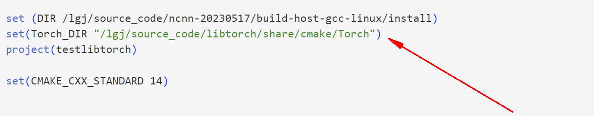

### 安装配置libtorch，opencv，ncnn

```
参考这篇博客
https://blog.csdn.net/u013250861/article/details/127829590
opencv版本3.4.12
libtorch版本1.9.1cpu版本
cmake 版本3.23.0
gcc g++ 8.4.0
wget https://github.com/Tencent/ncnn/archive/refs/tags/20230517.tar.gz
mkdir build
cd build
cmake …
make –j4

```


## 使用方式

```
将libtorch,和ncnn位置改成自己的安装位置（如下图所示）
cd face_recognition_cpp
mkdir build
cd build
cmake ..
make -j4
./demo
```

